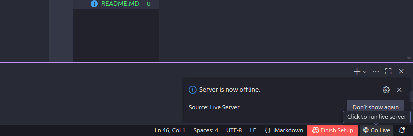

## CRUD Prueba de Desempeño

Este es un proyecto para mostrar el conocimiento que obtuvimos a traves de del modulo 3 de JavaScript, aqui teniamos que simular una pagina de eventos implementando una interfaz de usuario sencilla y amigable, y lo mas importante, que el usuario admin pueda hacer metodos CRUD mediante la interfaz para guardar, tomar, editar y eliminar informacion de una "base de datos" (db.json)

## Informacion del Autor
Nombre: Jose Tomas Loaiza Rodriguez
Clan: Ritchie
Correo: loaizarodrigueztomas@gmail.com
CC: 1027660283

## Link del repositorio del proyecto
https://github.com/Oomass7/Prueba-desempe-o-modulo-3

## Como utilizar
Como vamos a utilizar un archivo .json para poder guardar la informacion, no podremos agregar la funcionalidad al GitHub Pages, entonces voy a explicarte como utilizar la aplicacion.

----
**1. Descargar Visual Studio Code**
Aqui te dejare el link de la pagina oficial de VSCode para que puedas descargarlo y ademas un video guia.

Pagina oficial: https://code.visualstudio.com/download
Video guia: https://www.youtube.com/watch?v=8JCVAiSZAAM

----
**2. Descargar Node JS**
Este progrmaa es necesario para poder utilizar nuestro archivo .json. volvere a dejarte el link de la pagina oficial y una video guia

Pagina oficial: https://nodejs.org/es/download
Video guia: https://www.youtube.com/watch?v=iMStDdk5alg

**3. Descargar el archivo de la aplicacion**
Ahora solo tienes que descargar el proyecto en caso de no lo tengas y estes en el repositorio.

**4. Instalar extension live server**
Ahora entra a VSCode y descarga la extension live server
1. 
2. 

**5. Correr el proyecto**
ahora solo teines que escribir este comando en la terminal

json-server --watch ./data/db.json

y darle al live server

